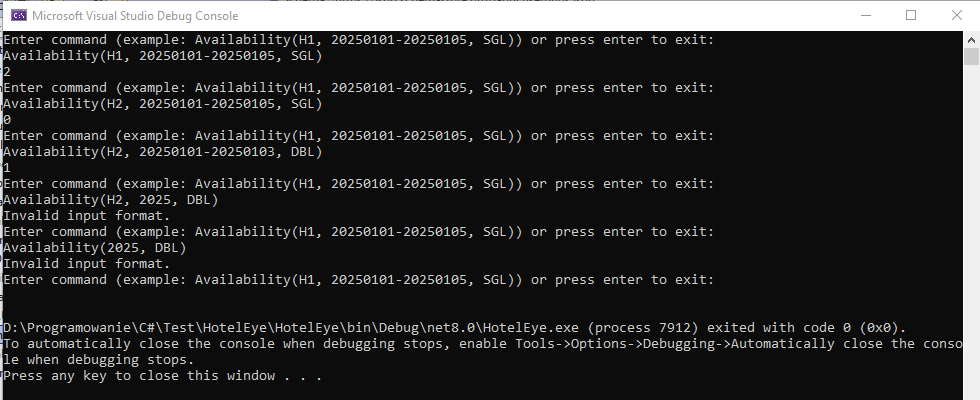

# HotelEye
Program which allows to preview hotel room availability and reservations.

Guide:
1. Use Microsoft Visual Studio to load project by opening file ```HotelEye.sln```.
2. Launch program in the IDE.

- Command line arguments with paths to data files can be changed inside file
 ```Properties/launchSettings.json```.
- Command pattern for checking hotel room availability is:\
```Availability(hotelId, arrivalDate, roomType)``` (one day stay)\
or\
```Availability(hotelId, arrivalDate-departureDate, roomType)```\
Note that arrivalDate and departureDate have to be in format: yyyyMMdd.
- Unit tests can be run in project HotelEye.UnitTests.

Screenshot:

